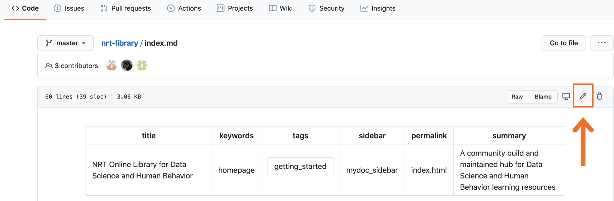
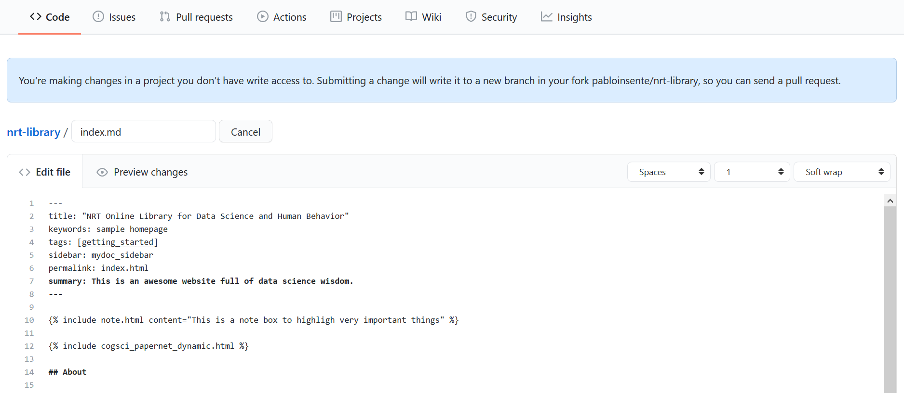
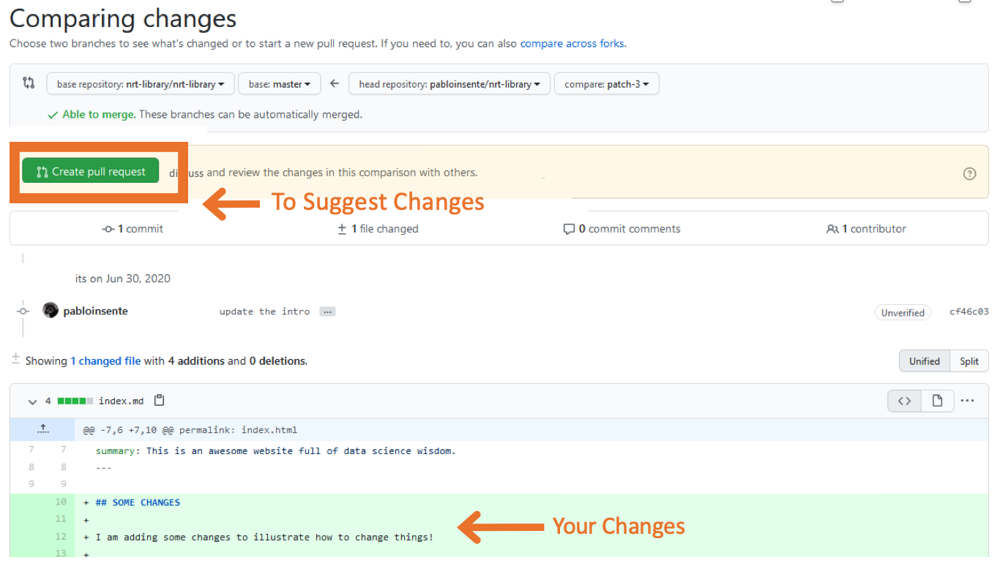
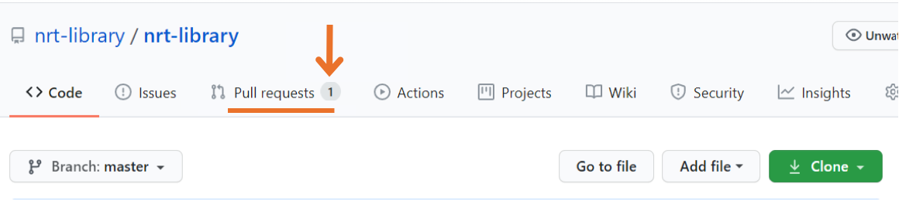
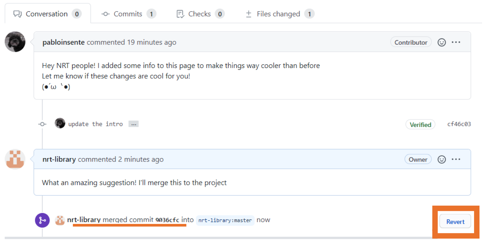
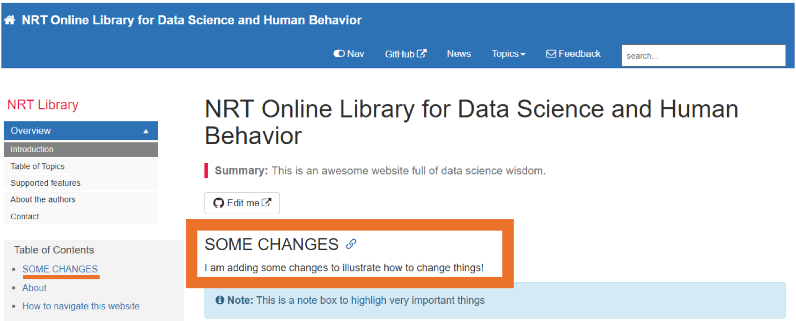

# Instructions to change existing section and to merge changes

## Changing/updating the site

There are instructions to change/update the contents of existing sections in the site. I also provide instructions to merge changes as a maintainer.

Click in the `Edit me` icon at the top of the page you want to change

You will be redirected to the website GitHub repository for that section. There, click in the pen icon to edit the contents. You will need a GitHub account to edit the contents. If you do not have one, GitHub will guide you on the creation of a new account. Unless you have write access (i.e., you are one of the main developers for the project), GitHub will "fork" the repository into your account. A "fork" is simply a clone of the repository in your account.

There you will find an interface like the one in the image below to edit the contents using plain markdown syntaxis. If you are not familiar with Markdown, [here is a guide](https://www.markdownguide.org/basic-syntax/) with all the basics

You can preview your changes by clicking in the `Preview changes` tab.

Once you are done with your changes, go to the bottom to the page where you'll find the `Propose changes` box. There add a short title for your changes in the first box, a longer message describing the changes in the second box, and then hit the `Propose changes` button.

Once you hit `Propose changes`, you will be redirected to the `Comparing changes` section, where you will be able to see your changes highlighted in green, and the `Create pull request`. A "pull request" is a way to ask the main maintainers to the project to incorporate the changes in the project. Hit the `Create a pull request` button once you are ready to ask for changes to the maintainers.

Once you hit the `Create a pull request` button, you will be redirected to the `Open a pull request` section. Hit the `Create a pull request` again to finalize the process.

You will be redirected to the pull request discussion board. Here you and the main maintainers can discuss the changes by leaving comments. 

## Merge changes as a maintainer

Only maintainers with writing access can merge pull requests. On the landing page of the site repository, you will find a new pull request in the `Pull request` tab. Click there to see pull requests.

You will find active pull requests with a green icon. Click there to access to the pull request.

There you will find the pull request with the contributor message. You can discuss changes by leaving messages in the comment box at the bottom.

Before merge changes, you can check the suggested changes in the `Files changes` tab. You can also edit the suggested changes by clicking the `Review changes` icon.

Once you are ready, hit the merge pull request in the `Conversation` tab. Github will ask you to confirm the merge. Hit the `Confirm merge` to finalize the process.

After the merge, you will see a confirmation message and the option to revert the merge if necessary.  

The changes will be reflected in the NRT website in a couple of minutes. If you still see the old version, try opening the site in an `incognito` tab or by cleaning the cash and navigation history in your browser.

