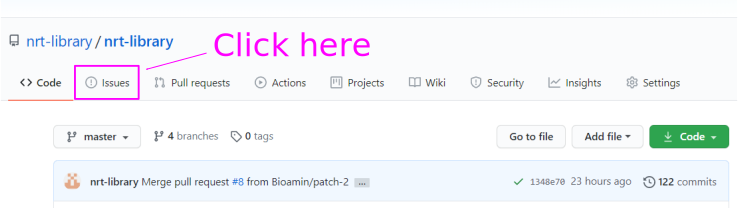
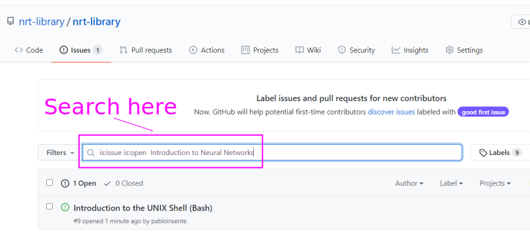
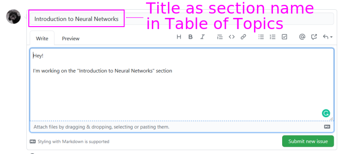
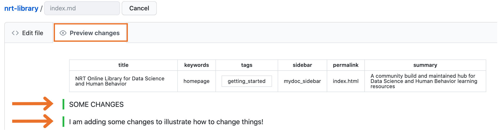
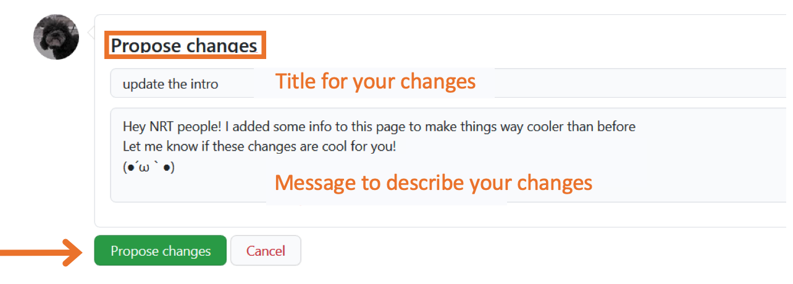
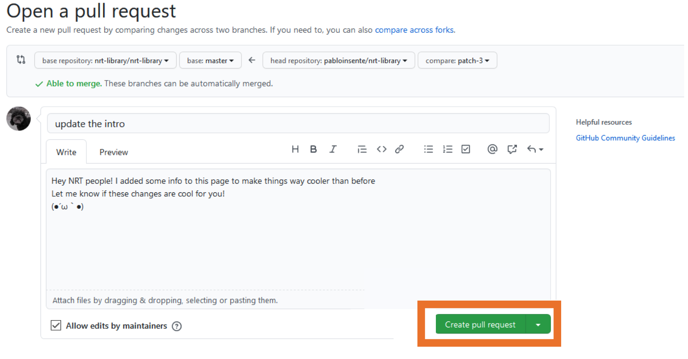
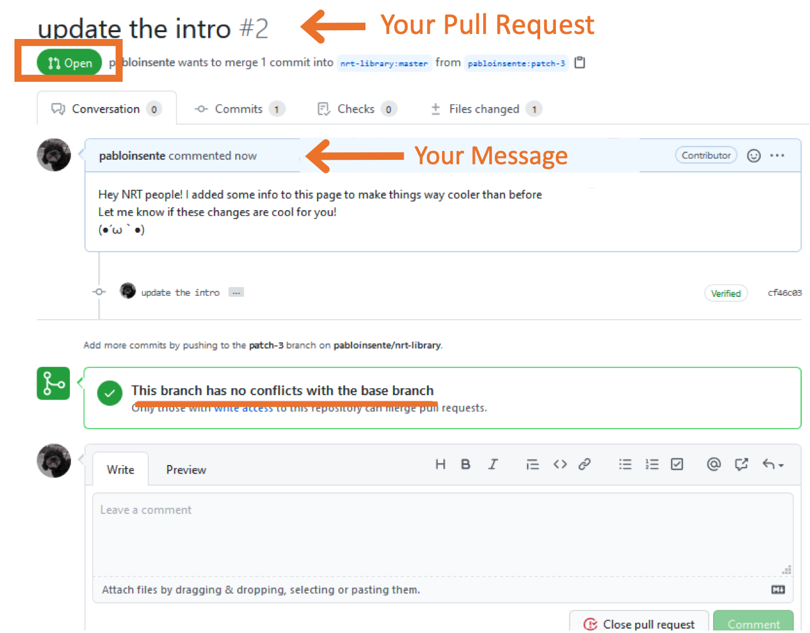
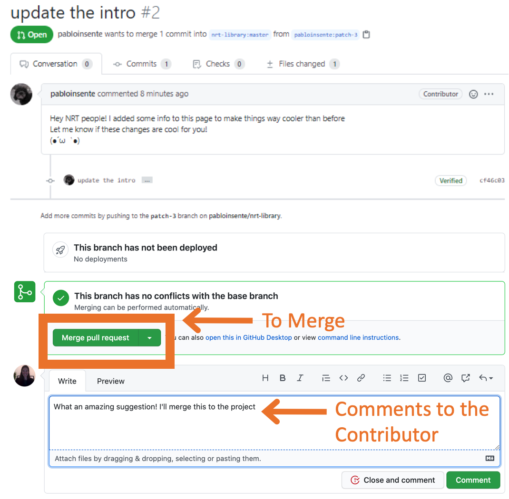
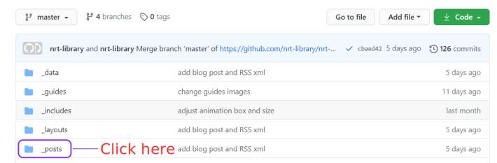
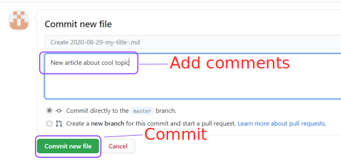

## Before contributing to the site 

The first step for contributing new content to the site is **to check which sections are currently under modification by other users**. This step is crucial to avoid conflicts between your modifications and the ones from other users. 

Go to the NRT Library GitHub repository ([here](https://github.com/nrt-library/nrt-library)) and click on **Issues**



Search for the name of the topic you want to edit **exactly as it appears** on the [Table of Topics](https://nrt-library.github.io/nrt-library/mydoc_topics.html) section. For instance, if you wish to modify the "Introduction to Neural Networks" section, do not search for "Intro to Neural Networks" or "Introduction to Neural Nets" but as it's originally spelled. 



If you do not find **open** issues, you can edit the section freely. 


Before modifying anything, **create a new issue** to let others know you will be working on that section. 


The title of the new issue must be **the same** as the title of the section in the Table of topics. 



Submit your issue and read the next steps to contribute content. 


## Content quality guidelines

We want to maintain the highest possible standard of quality for the content we share with the community. When adding new contents as links to videos, scientific articles, and/or tutorials, please keep in mind their: 

- **Accessibility**: Is it accessible for a wide variety of knowledge and skill levels? 
- **Thoroughness**: Does it cover the key elements necessary to understand the subject?
- **Availability**: Is it available free of charge? Is it available for users in different countries?
- **Style**: Does the resource (i.e., speaker or writer) uses a welcoming and inclusive language to convey the content?
- **Ethics**: Does the resource utilizes examples or teaches methods which can be harmful in any manner to vulnerable populations? 

Finally, ask yourself if the resource or content in question is something **you feel excited and/or proud to share with others**. 

## Recommended path for learning

Each topic has a suggested **template** to contribute content. There you will find a **Recommended path for learning** subsection. The goal of such a section is to select 1 to 3 links to high-quality articles or videos that quickly introduce the topic. Pick the ones you think are better to get someone started on the topic. You can find examples [here](https://nrt-library.github.io/nrt-library/jupyter.html#recommended-path-for-learning) and [here](https://nrt-library.github.io/nrt-library/support_vector_machines.html). 

## Complementing and updating the site contents

Here are instructions to complement and/or update the contents of *existing sections* in the site. At the end of the document you can findinstructions to merge changes as a **maintainer**.

The first step is to click in the `Edit me` icon at the top of the page you want to change as shown below:


You will be redirected to the website GitHub repository for that section. There, click in the pen icon to edit the contents. You will need a GitHub account to edit the contents. If you do not have one, GitHub will guide you on the creation of a new account. Unless you have "writing access" (i.e., you are one of the main developers for the project), GitHub will "fork" the repository into your account. A "fork" is simply a clone of the repository in your account.


There you will find an interface like the one in the image below to edit the contents using plain Markdown syntaxis. If you are not familiar with Markdown, [here is a guide](https://www.markdownguide.org/basic-syntax/) with the basics.


You can preview your changes by clicking in the `Preview changes` tab.



Once you are done with your changes, go to the bottom to the page where you'll find the `Propose changes` box. There add a short title for your changes in the first box, a longer message describing the changes in the second box, and then hit the `Propose changes` button.



Once you hit `Propose changes`, you will be redirected to the `Comparing changes` section, where you will be able to see your changes highlighted in green, and the `Create pull request`. A **pull request** is a way to ask the project maintainers to incorporate your changes into the project. Hit the `Create a pull request` button once you are ready to ask for changes to the maintainers.


Once you hit the `Create a pull request` button, you will be redirected to the `Open a pull request` section. Hit the `Create a pull request` again to finalize the process.



You will be redirected to the pull request discussion board. Here you and the main maintainers can discuss the changes by leaving comments.



## Merge changes as a maintainer

Only **maintainers** with writing access can merge pull requests. On the landing page of the site repository, you will find a new pull request in the `Pull request` tab. Click there to see pull requests.


There you will find active pull requests with a green icon. Click it to access to the pull request contents.


There you will find the pull request with the contributor message. You can discuss changes by leaving messages in the comment box at the bottom.



Before merge changes, you can check the suggested changes in the `Files changes` tab. You can also edit the suggested changes by clicking the `Review changes` icon.


Once you are ready, hit the merge pull request in the `Conversation` tab. Github will ask you to confirm the merge. Hit the `Confirm merge` to finalize the process.


After the merge, you will see a confirmation message and the option to revert the merge if necessary.  


The changes will be reflected in the DS&HB library site in a couple of minutes. If you still see the old version, try opening the site in an `incognito` tab or by cleaning the cash and navigation history in your browser.


## Add a new blog post

To add a new post in the NRT blog, go to the NRT Library GitHub repository ([here](https://github.com/nrt-library/nrt-library)) and navigate into the `_post` directory. 



Click on **Create a new file**


Give **a title** to your article following the `yyyy-mm-dd-my-title.md` format. Then copy and paste the template below as a header for the article replacing the "title:" and "permalink:" fields: 

```
---
title:  "My article name"
categories: news # leave it as it is
permalink: url-for-my-article.html # replace with something indicative of your title
tags: [news] # leave it as it is
---
```


Then you can **add the content** for your article below the `---`

Finally, **commit the article** adding a note about your content. It is recommended to check how does your article look with the **Preview changes** feature. 



